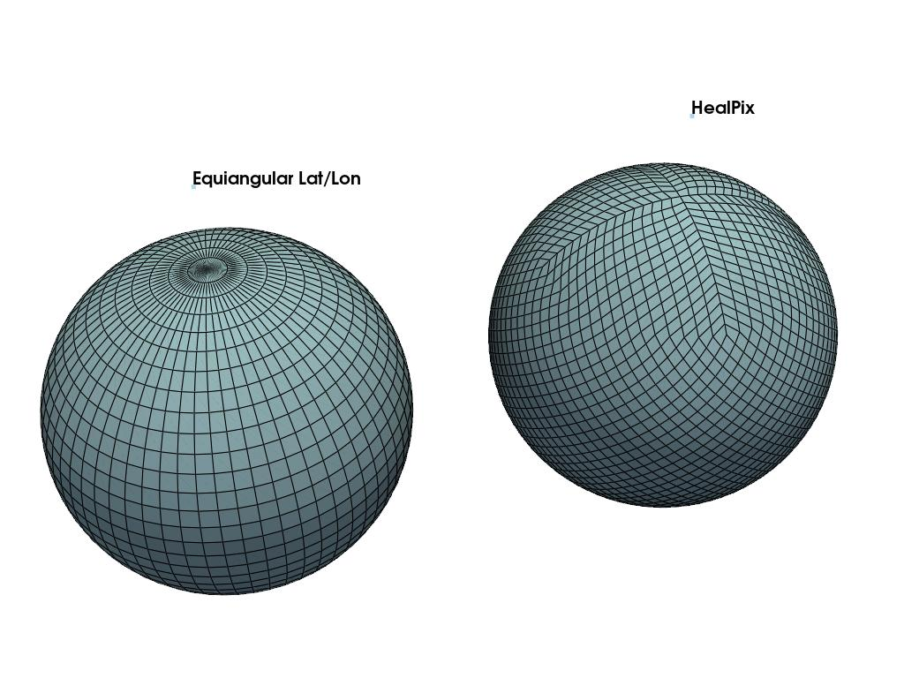

# Earth2 Grid Utilities


[](https://pypi.org/project/earth2-grid/)
[](https://pypi.org/project/earth2-grid/)
[](https://github.com/waynerv/earth2-grid/actions/workflows/dev.yml)
[](https://codecov.io/github/waynerv/earth2-grid)




Utilities for working geographic data defined on various grids.

Features:
- regridding

Grids currently supported:
- regular lat lon
- HealPIX

Under construction:
- exporting meshes to visualization software (e.g. VTK)
- neural network primitives for different grids:
  - convolutional layers
  - up/downsampling
- staggered grids


* Documentation: <https://earth-2.gitlab-master-pages.nvidia.com/earth2grid>
* GitHub: <https://github.com/waynerv/earth2-grid>
* PyPI: <https://pypi.org/project/earth2-grid/>
* Free software: BSD-3-Clause

## Install


```
git clone ssh://git@gitlab-master.nvidia.com:12051/earth-2/earth2-grid.git
pip install earth2-grid
```

## Example

```
>>> import earth2grid
... # level is the resolution
... level = 6
... hpx = earth2grid.healpix.Grid(level=level, pixel_order=earth2grid.healpix.PixelOrder.XY)
... src = earth2grid.latlon.equiangular_lat_lon_grid(32, 64)
... z_torch = torch.as_tensor(z)
... z_torch = torch.as_tensor(z)
>>> regrid = earth2grid.get_regridder(src, hpx)
>>> z_hpx = regrid(z_torch)
>>> z_hpx.shape
torch.Size([49152])
>>> nside = 2**level
... reshaped = z_hpx.reshape(12, nside, nside)
... lat_r = hpx.lat.reshape(12, nside, nside)
... lon_r = hpx.lon.reshape(12, nside, nside)
>>> reshaped.shape
torch.Size([12, 64, 64])
```


## Features

* TODO

## Credits

This package was created with [Cookiecutter](https://github.com/audreyr/cookiecutter) and the [waynerv/cookiecutter-pypackage](https://github.com/waynerv/cookiecutter-pypackage) project template.
